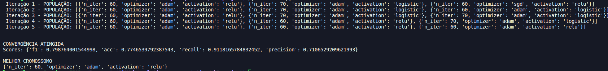

# Projeto AB2


## Requisitos

[Python](https://www.python.org/)

[Scikit-learn](https://scikit-learn.org/stable/)

[pandas](https://pandas.pydata.org/docs/index.html)

[numpy](https://numpy.org/)

## Dados

[Dados](https://drive.google.com/file/d/1aKvY_UdoJdn9y9mHwGCATetPjcAAwCcW/view?usp=sharing)

## Como rodar

Salve o arquivo `X32.npy` na pasta do projeto e execute o arquivo `main.py` com o seguinte comando no terminal:

```
python main.py
```

## Exemplo de saída



Onde:

**f1:** F1-score

**acc:** Acurácia

**precision:** Precisão

**recall:** Recall
